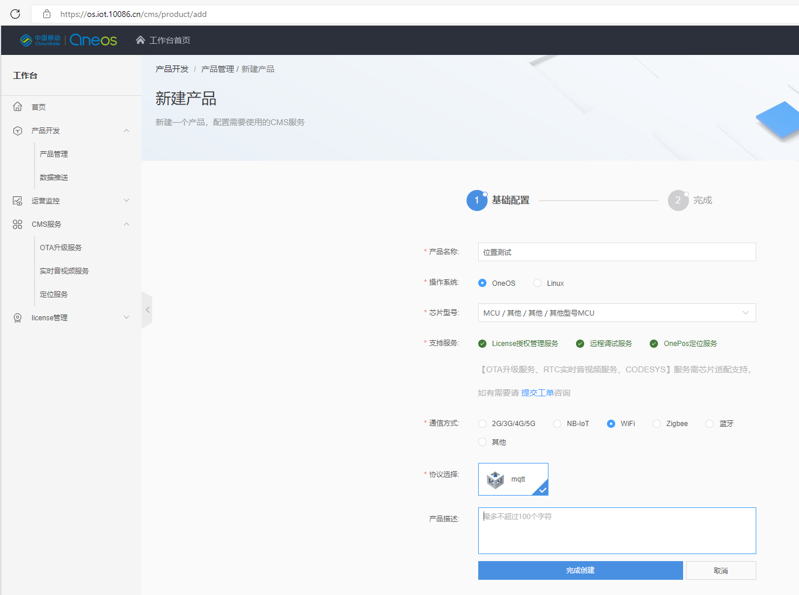

## oneos网络定位组件体验

- 参考：[OneOS 位置组件应用及实战总览](https://my.oschina.net/u/5776492/blog/5564681)

- 参考：OneOS定位服务：[https://os.iot.10086.cn/v2/doc/detailPage/documentHtml?idss=157168272348028928&proId=156814190282285056](https://os.iot.10086.cn/v2/doc/detailPage/documentHtml?idss=157168272348028928&proId=156814190282285056)

### 总体介绍：
OneOS 位置组件是 OneOS 端云融合的一个典型应用组件，由一个平台、三大服务组成，分别是位置服务平台、Wi-Fi 定位服务、AGNSS 快速定位服务、RTK/RTD 高精度定位服务，为穿戴、工业、交通、测绘、电力等行业提供各种精度的定位能力。

本文使用正点原子战舰V3开发板对 OneOS 位置服务组件的体验

AGNSS功能需要有gnss定位模组，且功能为加快冷启动定位速度，因此本文仅测试WiFi网络定位功能；
4G模组配置功能类似，参考“OneOS 位置组件应用及实战总览”和本文配置即可

### 准备项：
- 复制战舰系列文章添加串口驱动篇的 stm32f103zet6-atk-warship_v3-serial 文件夹，并重命名为 stm32f103zet6-atk-warship_v3-serial-position
- 也可以从gitee仓库克隆：https://gitee.com/dreamfly233/OneOS/tree/projects_OneOS-v2.3.0/projects 获取stm32f103zet6-atk-warship_v3-serial 工程文件夹
- 硬件使用esp8266模组，接在ATK MODULE上，即串口3上，若使用的串口未添加驱动，则需要添加串口驱动

如图：

### OneOS-CMS 平台配置：

进入oneos官网 [https://os.iot.10086.cn/](https://os.iot.10086.cn/)

注册登录过程，及实名认证过程按网站提示操作

登录后点击右上角工作台，依次选择  产品开发/产品管理/新建产品，参考下图配置即可

创建后，可以在产品详情页查看产品ID和密钥

创建产品后，还需要配置定位服务，在工作台中点击CMS服务/定位服务，在新页面点击产品列表，找到新建的产品的服务配置选项，agnss辅助定位这里不需要就不勾选了，其他功能都可以勾选上

至此云端就配置完成了，体验上与onenet类似

### 网络定位功能配置

进入stm32f103zet6-atk-warship_v3-serial-position文件夹，已添加了串口3驱动，直接进入menuconfig配置即可：在文件夹中打开oneos cube，输入menuconfig

#### 配置CMS连接部分：
定位到Components→ CMS→ CMS Connect 使能 CMS Connect 组件：

定位到Components→ CMS→ CMS ID 使能 CMS ID 组件，并配置产品 id 和 key（即产品详情页的产品ID和产品密钥）
**配置方式：使用上下方向键定位到配置框后，按回车进入编辑，编辑完成后再按一次回车保存**

#### 配置通信模组部分：
定位到Components→ Network→ Molink，勾选Enable IoT modules support项，然后定位到  Modules → WiFi Modules Support → ESP8266 → ESP8266 Config
串口设备和波特率按实际硬件勾选，AP SSID和AP password即WiFi的名称和密码，也需要自行配置，Enable ESP8266 Module BSD Socket Operates项也要勾选

#### 配置定位组件：
定位到 Components→ Position，勾选enable position support项，以及onepos support command项

定位到 Components → Position → enable position support → network positon → enable network positon → wifi positon，勾选network positon using wifi positon项

其他配置默认即可，配置完成后esc退出menuconfig并保存
然后调用scons --ide-mdk5生成mdk工程
生成后打开工程，编译下载

### 定位功能体验：

下载后打开shell，查看输出：
连接成功后shell将正常运行
输入onepos start命令：

此时进入网页的定位服务/产品管理/设备调试页面，可以看到在线设备，点击设备详情即可看到在地图上看到设备的位置信息

### 小结：
oneos提供的onepos组件对于有wifi/基站定位需求的客户，接入还是很方便的，molink支持的模组方便集成，支持云端下发定位结果也便于处理定位信息

AGNSS技术常见于手机等设备，通过网络下载星历加速定位，onepos也实现了这个功能

GNSS定位功能参考官方文档：[https://os.iot.10086.cn/v2/doc/detailPage/documentHtml?idss=157171737933651968&proId=156814190282285056](https://os.iot.10086.cn/v2/doc/detailPage/documentHtml?idss=157171737933651968&proId=156814190282285056)

