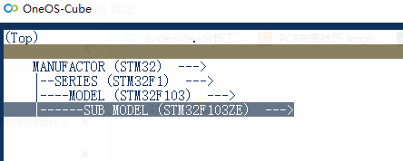
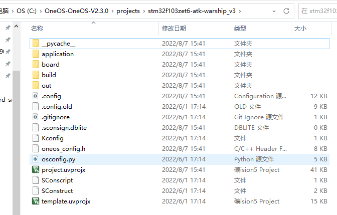
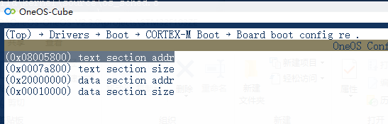
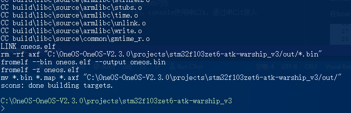
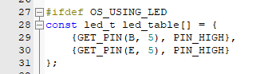
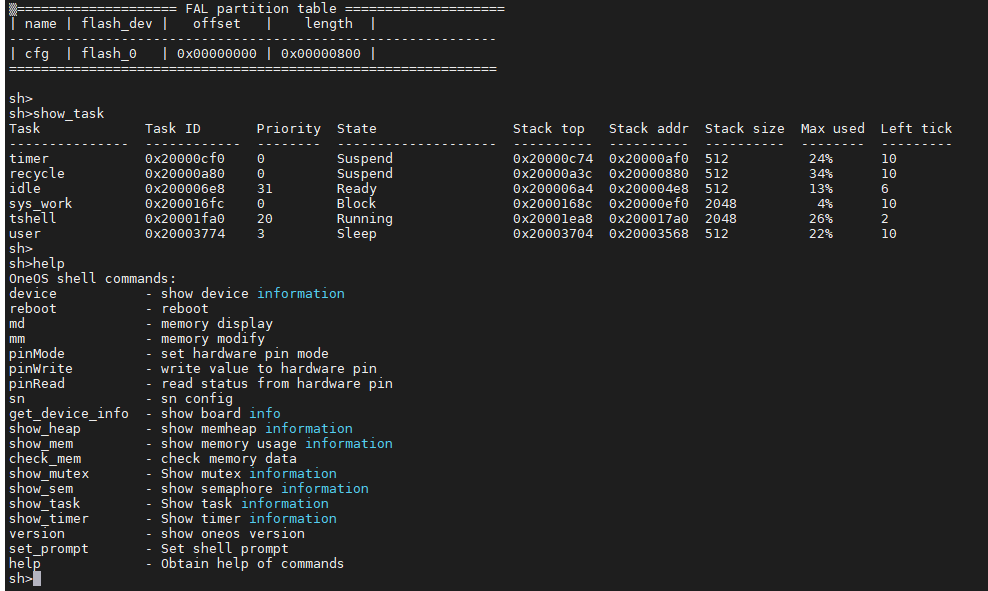
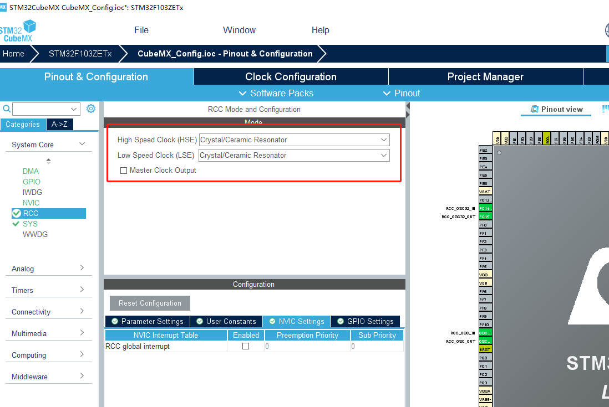
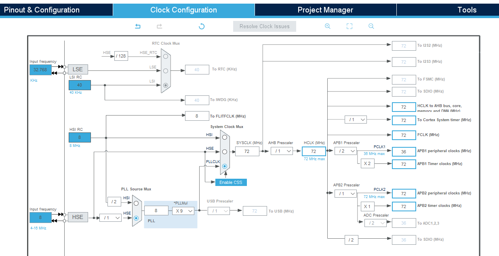
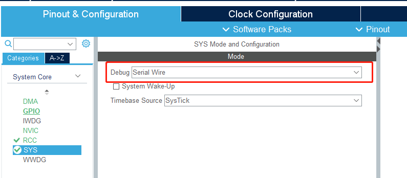
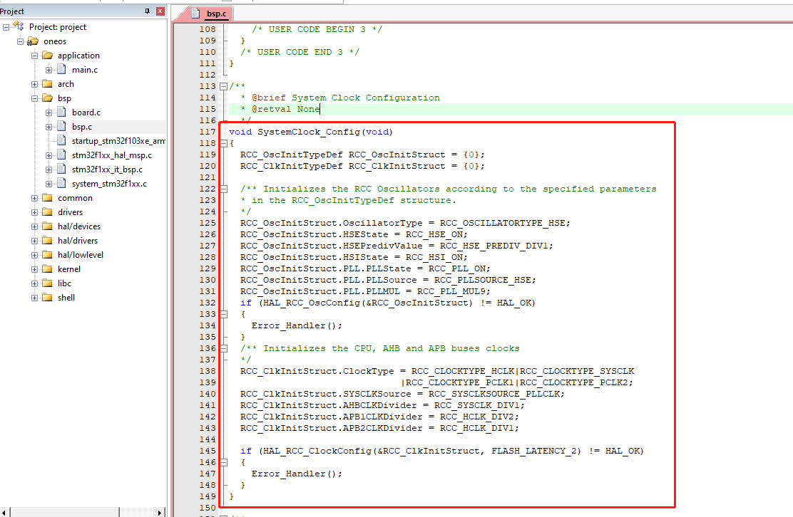

## 战舰V3适配oneos系列01：bsp适配
本系列以oneos2.3.0提供的STM32F103ZE模板为基础，将oneos在战舰V3上运行起来，并逐步适配相关外设
本系列计划周更
本系列相关代码将上传gitee供测试体验，仓库：
https://gitee.com/dreamfly233/OneOS/tree/OneOS-V2.3.0/

 ### 准备项
 - 获取oneos2.3.0的代码：https://gitee.com/cmcc-oneos/OneOS/tree/OneOS-V2.3.0/
 - 安装oneos cube：https://os.iot.10086.cn/v2/doc/detailPage/documentHtml?idss=157067959888781312&proId=156799478777782272
 - 安装stm32cubemx，推荐6.3.0

## 生成工程：
在oneos/project文件夹下执行project.bat，
选择如图:

注意SUB MODEL选择STM32F103ZE
按esc退出并保存后，将生成STM32F103ZE的工程，建议将生成的文件夹改名, 以开发板型号为名方便区分, 这里将生成的STM32F103ZE文件夹更名为stm32f103zet6-atk-warship_v3

打开stm32f103zet6-atk-warship_v3文件夹，可以看到熟悉的目录结构：

在该目录下打开oneos cube，进入menuconfig

- 注意：BOOT项需要修改：将text section addr项修改为0x08000000，否则工程不能正常启动；
- 若按默认的boot偏移制作并烧录了bootloader，则可忽略该项

保存退出后，使用scons --ide=mdk5命令生成mdk5工程：

双击project.uvprojx打开工程

编译后是可以直接下载进板子运行的(默认配置使用内部时钟HSI)，stlink等下载器选项自行修改
 - 下载器选项、下载算法等内容可在template.uvprojx工程修改，修改后生成的mdk工程将使用模板工程的配置

在board.c中修改LED引脚, 战舰为PB5和PE5, 修改后如下

重新编译后烧录运行, 即可看到LED闪烁
默认是配置了shell命令行的，使用串口1，将串口1接入电脑，可以看到shell正常运行

## 修改时钟：

使用stm32cubemx打开"board\CubeMX_Config\CubeMX_Config.ioc"，选中外部时钟

修改时钟树: 主频改为72Mhz:

另外需要检查debug是否已开启，若sw被禁用会给烧录程序带来不便：

其他选项暂时不修改, 选择生成代码

cubemx生成的"stm32f1xx_hal_msp.c"已被包含进工程, 主要对外设的时钟，引脚复用，DMA等进行配置，并对外设引脚进行初始化

cubemx生成的main.c中, 含有时钟初始化函数和外设功能初始化函数, 这里只需要修改时钟配置

打开"board\CubeMX_Config\Src\main.c" ，将SystemClock_Config函数复制并替换oneos工程bsp.c中的SystemClock_Config函数, 结果如下:

至此，oneos在战舰v3上的适配初步完成，时钟已修改为外置时钟, 串口1和shell已适配，添加外设将在后续更新

这里注意：
- scons --ide=mdk5生成mdk工程时, 将会通过脚本自动将外设初始化函数从cubemx生成的main.c中复制到bsp.c中(会使用cubemx的外设初始化配置, 例如串口波特率配置等, 需要在cubemx中正确配置), 包含时钟配置函数, 只需生成mdk工程后进行检查

- 另外scons --ide=mdk5生成工程时会根据cubemx中的配置生成"board/peripherals.c", 这将是设备驱动模型注册设备信息的依据，该.c文件通过include包含，无需也不能加入工程编译，该文件可实现cubemx添加外设后，自动注册到设备驱动模型

总结：在cubemx修改外设配置、时钟后，调用一次scons --ide=mdk5可以自动将相关配置复制到工程

