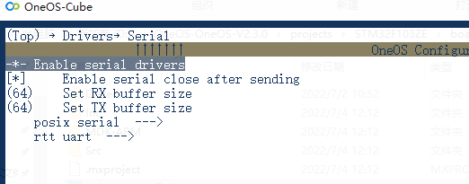

## 战舰V3适配oneos系列02：添加串口驱动

参考:
https://os.iot.10086.cn/v2/doc/detailPage/documentHtml?idss=157461531750309888&proId=156809201128316928

## 简介:
Serial 设备是对 uart 硬件的应用抽象层，应用程序通过 OneOS 提供的 Serial 设备管理接口来访问串口硬件。

本开发指南给用户提供了 Serial 的基本配置，Serial 工程配置测试和 API 介绍。

- 准备项：复制上个教程的stm32f103zet6-atk-warship_v3文件夹，并重命名为stm32f103zet6-atk-warship_v3-serial，如图：

### 使用STM32CubeMX配置硬件

1.打开 projects\stm32f103zet6-atk-warship_v3-serial\board\CubeMX_Config 下 的 cubemx 工程文件(CubeMX_Config.ioc)；
2.在cubemx工程中进行 Serial 配置，如下图所示，选中 UART，配置工作模式，分配引脚；
UART1已配置, 这里以uart3为例, 配置如下

串口参数配置如波特率等按实际情况修改

勾选使能串口中断

**DMA建议进行配置，仅勾选中断会在应用中出现丢包情况，待研究驱动层处理方式，此处按官方文档配置DMA**

配置完成后点击生成代码

### 配置和生成工程
在对应的 projects\stm32f103zet6-atk-warship_v3-serial 目录下打开 OneOS-Cube 工具，在命令行输入 menuconfig 打开可视化配置界面；
确保 Drivers-> Enable serial drivers项已勾选

通过 Esc 键退出配置界面，退出时选择保存；

在打开的 OneOS-Cube 工具命令行中输入 scons --ide=mdk5 重新构建工程。

scons --ide=mdk5生成工程时会根据cubemx中的外设配置生成"board/peripherals.c", 这将是设备管理层注册设备信息的依据

- **使用cubemx生成代码后, 需要调用一次 scons --ide=mdk5 重新生成mdk工程**

生成mdk工程后，编译下载，在shell中使用device查看生成的设备
可以看到这里出现了设备uart3

### 串口外设测试:
将"demos\driver\serial_test.c" 复制到"projects\stm32f103zet6-atk-warship_v3-serial\application"文件夹下,并加入mdk工程中, 编译下载

硬件上将uart3通过USB转串口连接到电脑, 另开一个串口调试助手与uart3通信
测试serial_tx_test 和serial_rx_test命令

短接串口收发引脚也可以快速测试串口是否正常，使用serial_block_test命令测试，自发自收并进行crc校检：

至此成功添加串口驱动

预告：(支线项目, 串口连接esp8266, 通过molink联网, 使用oneoet组件快速接入onenet平台)

