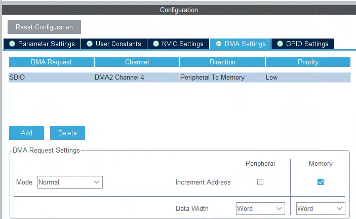
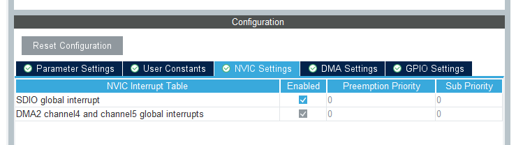

## 战舰V3系列03：添加SD卡驱动及文件系统

本系列以 oneos2.3.0 提供的 STM32F103ZE 模板为基础，将 oneos 在战舰 V3 上运行起来，并逐步适配相关外设，计划周更

本系列相关代码将上传 gitee 供测试体验，仓库： https://gitee.com/dreamfly233/OneOS/tree/OneOS-V2.3.0/

这是本系列的第3期，尝试修复ST非H7系列SDIO驱动的问题，影响正点原子战舰V3、万耦天工等SDIO连接SD卡的开发板，并进行挂载文件系统的实验

### 准备项：
复制上个教程的stm32f103zet6-atk-warship_v3-serial文件夹，并重命名为stm32f103zet6-atk-warship_v3-sdcard

### cubemx配置：

下面是战舰V3 SD卡部分的原理图：

打开projects\stm32f103zet6-atk-warship_v3-sdcard\board\CubeMX_Config 下 的 cubemx 工程文件(CubeMX_Config.ioc)，参照原理图进行配置：

配置SDIO使用的dma：

勾选使能SDIO的中断：

完成以上配置后点击GENERATE CODE生成代码

### menuconfig配置及生成工程

在stm32f103zet6-atk-warship_v3-sdcard文件夹打开oneos-cube并进入menuconfig

定位到 Drivers→ SDIO下，勾选Using SD/MMC device drivers，Enable SDIO debug log output 项可选

sdio的日志依赖dlog输出，若上一步勾选了Enable SDIO debug log output项，在下面勾选dlog：

定位到Kernel→ Inter-task communication and synchronization，勾选上SDIO需要的内核IPC项如图：

这里按esc退出保存配置，并使用scons --ide=mdk5生成mdk工程

打开project.uvprojx工程

这里需要对"drivers\hal\st\drivers\drv_sdio.c"进行修改
添加SDIO_IRQHandler中断处理函数

对F103开发板，24M的频率过高需要调整，否则会出现如下报错：

调整SDIO工作频率

编译下载，在shell中使用device查看生成的设备：

出现sd0块设备，说明SDIO的SD卡驱动基本没有问题，下面可以挂载文件系统了

参考demos下的sd挂载例程，将"demos\driver\sdmmc_test.c"这个文件复制到"projects\stm32f103zet6-atk-warship_v3-sdcard\application"文件夹，并加入mdk工程

使用sdmmc_test命令进行挂载

成功挂载文件系统，使用echo、ls、mkdir、cat、rm等命令即可在shell中对文件系统进行测试：

- 注意：SD卡需要提前格式化为fat格式，建议格式化为fat32

