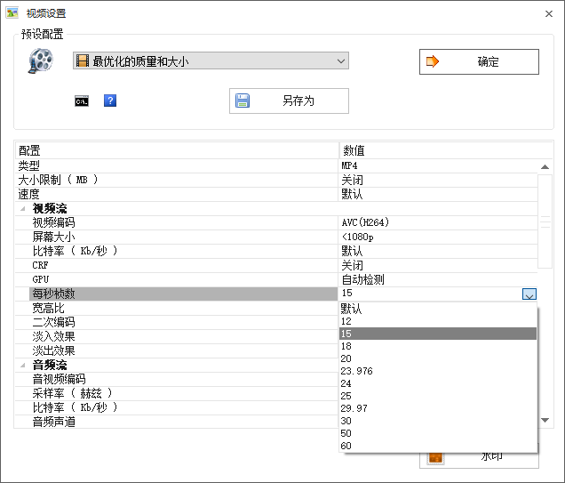
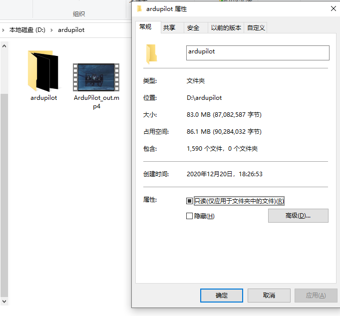
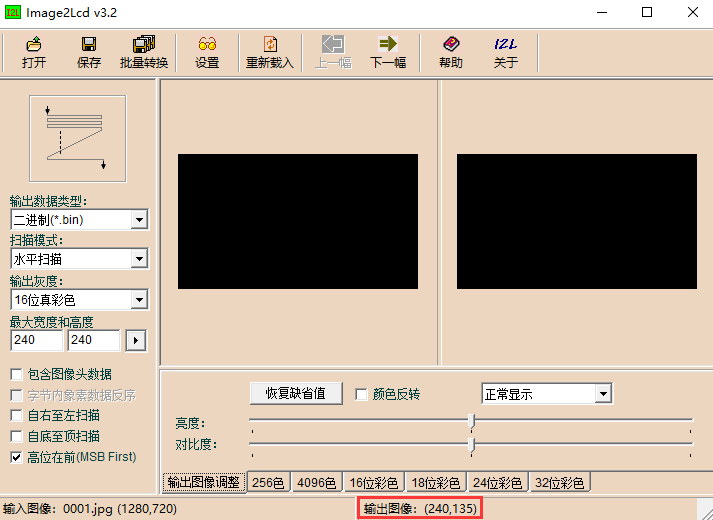
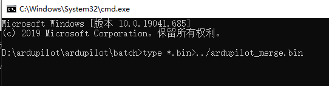
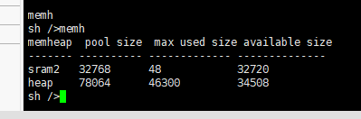
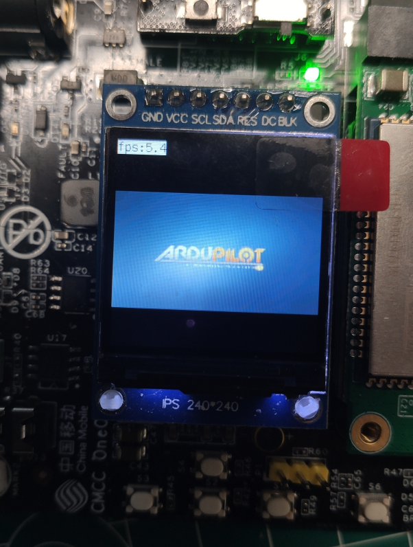
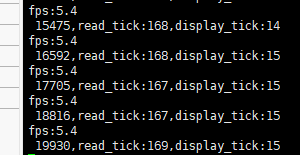
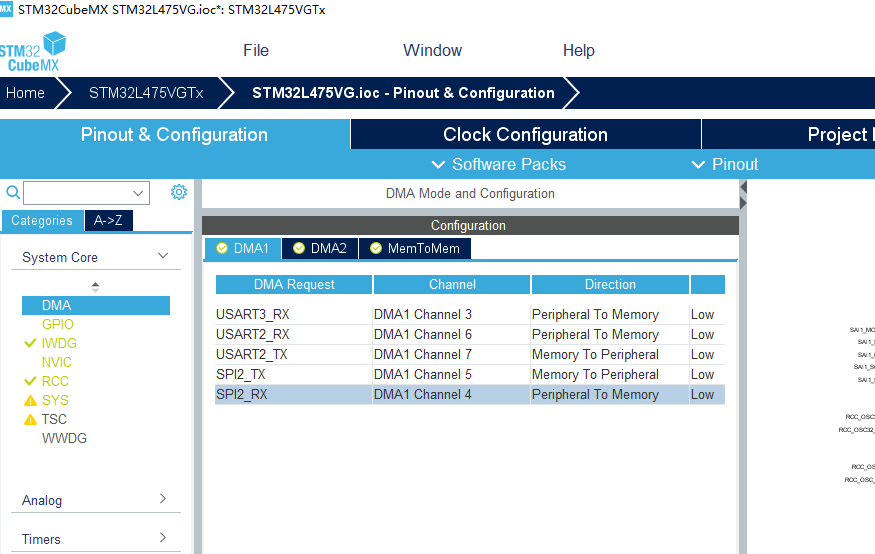
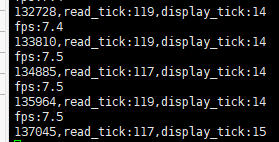
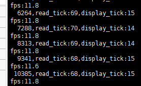

---

---

参考链接：[潘多拉开发板的Badapple显示](https://blog.csdn.net/qq_40427996/article/details/107734554)

### 前言：

之前一直想做单片机视频播放的尝试， 没啥思路就咕着，~~其实是懒~~。前段时间看到有万耦一代放badapple的视频，在网上查了一下，发现了这篇文章，步骤很详细，有思路了一些小坑也好踩，正好是一个实践机会，同时做了一些优化

### 目录

[TOC]

软硬件：

视频图片帧数据的提取(选取视频为16:9，240*135)
视频帧率更改
提取帧序列
转成二进制数据

图像的显示

优化：

刷屏速度问题查找原因

解决问题

### 软硬件：

中移万耦一代开发板，[oneos开发环境](https://os.iot.10086.cn/download/)，Matlab，格式工厂，image2Lcd软件

演示视频为ArduPilot宣传片，一个很有生命力的无人机开源项目

### 视频图片帧数据的提取

一般视频默认30帧，这里先改为15帧，保证与视频实际速度不会有太大出入

#### 提取帧序列

这里参考源博客，使用matlab转换

> clc
> clear
> apple='D:\ardupilot\ArduPilot_out.mp4';
> obj = VideoReader(apple);
> for i=1:1590 %视频1分46秒，每秒15帧
> badApple = read(obj,i);
> imwrite(badApple,strcat('D:\ardupilot\ardupilot',num2str(i,'%04d'),'.','jpg'));%若输出文件夹不存在会报错，需要先手动创建
> end

转换结果：

#### 转成二进制数据

使用image2Lcd软件（建议用3.2版本，带批量转换）

配置如图，由于源图片比例为16:9，可以看到实际输出尺寸为240*135，保持其他默认的情况下，这里需要勾选高位在前（MSB）

选择批量转换，等待转换完成（软件可能会无响应，等待即可）

#### 合并二进制文件

将生成1590张bin文件，（现在可以显示视频了，但由于文件分散，文件的open/close操作会比较慢，需要合并为一个bin文件）

这一步，按博主的操作出错了，网上查到的批处理合并方式虽然能合并，但合并结果有问题会导致图像错位，~~一气之下写了个合并程序~~，复查发现直接用博主的方式可以实现，需要把输出文件改个路径，否则会把输出文件自身再加到末尾，得到双倍尺寸的bin文件

切换到保存bin文件的目录，执行以下代码

`type *.bin>../ardupilot_merge.bin`

在上一级找到输出文件，放置到SD卡根目录即可

### 图像显示

使用oneos-1.2.0源码和配套的oneos-cube开发工具

这里要吐槽一下oneos，组件依赖有一些混乱；也没有必要把东西全加到bsp里，一个裁剪不是很舒服，默认ram占用有些高

程序需要64800字节（240\*135\*2）做帧缓冲，默认的ram不够，需要做一些裁剪

取消勾选drivers/audio、drivers/USB、 Components→ Network→ Molink

kernel下系统节拍默认100改为1000，memory management配置为Use all of memheap objects as heap（利用上L475的另外32k ram）

用[main.c](./figures/main.c )替换原有的main.c的内容，就可以看到视频播放啦，此时由于还未优化，帧率不高

#### 优化思路

从打印时间戳可以看出，刷屏耗时不长，但读取文件耗时太长，导致帧率过低，提升文件读取速度就能提高帧率，这里仅提供一个临时解决方案，还需要oneos团队完善现有的spi和dma框架

#### 优化方案

(drv_spi.c被其他project公用，谨慎修改)

修改drv_spi.c，在198行

>     if (HAL_SPI_Init(spi_handle) != HAL_OK)
>     {
>         return OS_EIO;
>     }

后面添加源码

> //////////////////////////////////////////////////////////////////////////DMA
> #if defined(SOC_SERIES_STM32L4) || defined(SOC_SERIES_STM32F0) \
>         || defined(SOC_SERIES_STM32F7) || defined(SOC_SERIES_STM32G0)
> SET_BIT(spi_handle->Instance->CR2, SPI_RXFIFO_THRESHOLD_HF);
> #endif
>
> /* DMA configuration */
>
> static os_uint8_t already_config=0;
> if (spi_drv->hspi->Instance==SPI2 && already_config==0)
> {
>     already_config=1;
>
>     extern DMA_HandleTypeDef hdma_spi2_tx;
>     
>     extern DMA_HandleTypeDef hdma_spi2_rx;
>
>     HAL_DMA_Init(&hdma_spi2_tx);
>     
>     __HAL_LINKDMA(spi_drv->hspi, hdmatx, hdma_spi2_tx);
>     
>     /* NVIC configuration for DMA transfer complete interrupt */
>     HAL_NVIC_SetPriority(DMA1_Channel4_IRQn, 0, 0);
>     HAL_NVIC_EnableIRQ(DMA1_Channel4_IRQn);
>
>     HAL_DMA_Init(&hdma_spi2_rx);
>     
>     __HAL_LINKDMA(spi_drv->hspi, hdmarx, hdma_spi2_rx);
>     
>     /* NVIC configuration for DMA transfer complete interrupt */
>     HAL_NVIC_SetPriority(DMA1_Channel5_IRQn, 0, 1);
>     HAL_NVIC_EnableIRQ(DMA1_Channel5_IRQn);
>     
>     spi_drv->spi_dma_flag=3;
>
> }
>
> __HAL_SPI_ENABLE(spi_handle);
> ////////////////////////////////////////////////////////////////////////DMA

用cubemx打开board\CubeMX_Config\STM32L475VG.ioc

添加SPI2_TX和SPI2_RX的DMA配置，并生成代码

编译通过，下载，可以看到读取速度有改善

~~接着超个频，~~ 在spi_msd.c第1181行，max_hz正常情况为10mhz，改为50mhz(这里会按50mhz计算spi分频，频率不会超过50mhz)

`cfg.max_hz = 1000 * 1000 * 50;`

编译下载，可以看到帧率基本接近预期了

最终效果：

完结撒花:)

### 后记

关于这个视频播放项目，这种优化带来的性能提升，还是很有成就感的

板子上带有音频接口，以后有机会也会把音频也加上